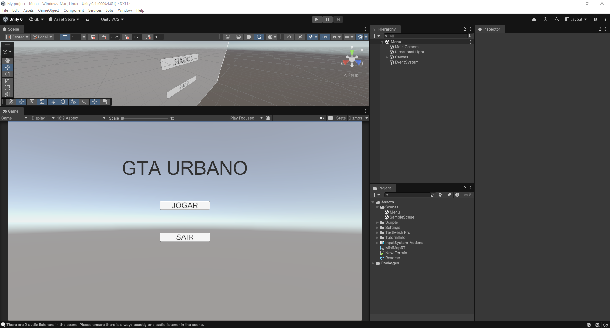
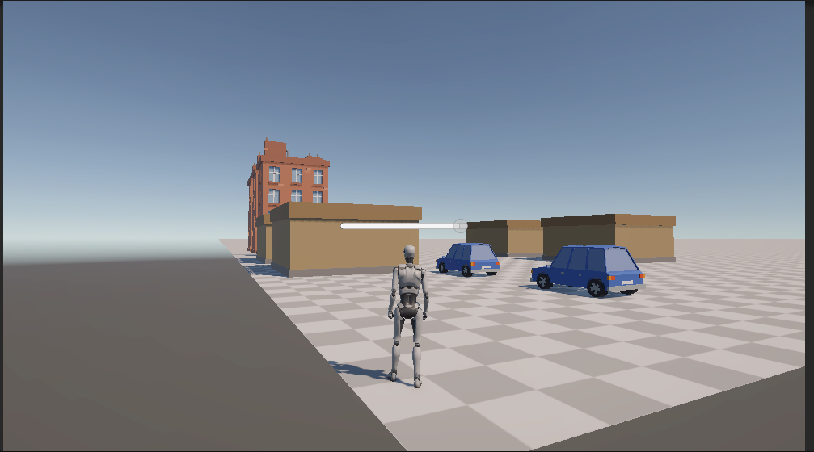
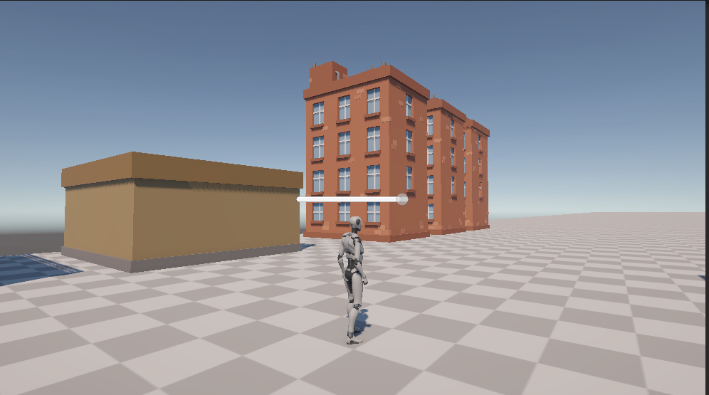

# 🏙️ GTA Urbano — Jogo 3D em Unity

> Trabalho do 2º Bimestre — Desenvolvimento de Jogos com Unity 3D

---

## 👤 Nome
Gabriel Paes Leme Costa

---

## 📖 Descrição do Jogo

**GTA Urbano** é um jogo de ação em terceira pessoa desenvolvido com Unity 3D, inspirado no estilo sandbox urbano do GTA. O jogador explora uma cidade em mundo aberto, enfrenta inimigos espalhados pelo mapa e deve sobreviver o máximo possível enquanto coleta pontos.

O jogo conta com sistema de clima dinâmico que altera a atmosfera da cena aleatoriamente, mini-mapa interativo no HUD e sistema completo de vida com tela de Game Over.

---

## 🎮 Instruções de Jogabilidade

| Ação            | Tecla / Controle         |
|-----------------|--------------------------|
| Mover           | `W A S D`                |
| Correr          | `W` + `Shift`            |
| Pular           | `Espaço`                 |
| Câmera          | `Mouse`                  |
| Zoom câmera     | `Scroll do Mouse`        |
| Pausar          | `Escape`                 |


---

## 🎬 Gameplay (Vídeo)

> 📺 https://youtu.be/hDwLWkrMe4s

<!-- Cole aqui o link embed do YouTube:
[](https://www.youtube.com/watch?v=SEU_VIDEO_ID)
-->

---

## 🖼️ Prints do Jogo






---

## ⚙️ Funcionalidades Desenvolvidas

---

### 1️⃣ Sistema de Chuva / Clima Dinâmico

Foi desenvolvido um sistema de clima que alterna automaticamente e de forma aleatória entre tempo ensolarado e chuvoso durante a partida, aumentando a imersividade do jogador. O sistema controla partículas de chuva, áudio ambiente em loop, intensidade e cor da iluminação direcional, além de neblina volumétrica — tudo com transição gradual via interpolação para que a mudança de clima seja suave e natural.

**Como funciona:**
- A cada ciclo, o sistema aguarda um tempo aleatório (entre 30s e 90s de sol) e então inicia a transição para chuva.
- A transição dura 5 segundos e interpola todos os parâmetros visuais e sonoros simultaneamente.
- Após um período chuvoso aleatório (entre 20s e 60s), o ciclo se repete voltando ao sol.

**Trecho do código — transição de clima:**

```csharp
IEnumerator TransicionarPara(EstadoClima novoEstado)
{
    climaAtual = novoEstado;
    float tempo = 0f;
    bool chovendo = (novoEstado == EstadoClima.Chuva);

    if (chovendo)
    {
        if (particulasChuva != null)   particulasChuva.Play();
        if (particulasSalpico != null) particulasSalpico.Play();
        IniciarAudioChuva();
    }

    Color  corLuzInicial      = luzDirecional.color;
    Color  corLuzFinal        = chovendo ? corLuzChuva : corLuzSol;
    float  intensidadeInicial = luzDirecional.intensity;
    float  intensidadeFinal   = chovendo ? intensidadeChuva : intensidadeSol;

    while (tempo < duracaoTransicao)
    {
        tempo += Time.deltaTime;
        float t = tempo / duracaoTransicao;

        luzDirecional.color     = Color.Lerp(corLuzInicial, corLuzFinal, t);
        luzDirecional.intensity = Mathf.Lerp(intensidadeInicial, intensidadeFinal, t);

        RenderSettings.fogColor   = Color.Lerp(..., chovendo ? corNeblinaChuva : corOriginal, t);
        RenderSettings.fogDensity = Mathf.Lerp(..., chovendo ? densidadeNeblina : densOriginal, t);

        if (audioChuvaPrincipal.isPlaying)
            audioChuvaPrincipal.volume = chovendo ? Mathf.Lerp(0f, 1f, t) : Mathf.Lerp(1f, 0f, t);

        yield return null;
    }
}
```

**Script completo:** [`Assets/Scripts/Systems/WeatherSystem.cs`](Assets/Scripts/Systems/WeatherSystem.cs)


---

### 2️⃣ Barra de Vida + Tela de Game Over

Foi implementado um sistema completo de saúde do jogador com barra de vida exibida no HUD que muda de cor dinamicamente conforme a vida diminui (verde → laranja → vermelho), feedback visual e sonoro ao receber dano, e uma tela de Game Over com a pontuação final que é exibida quando a vida chega a zero. O sistema paralisa o jogo (`Time.timeScale = 0`) para que o jogador possa ver a pontuação antes de reiniciar ou voltar ao menu.

**Trecho do código — receber dano e atualizar barra:**

```csharp
public void ReceberDano(float quantidade)
{
    if (_morreu) return;

    vidaAtual -= quantidade;
    vidaAtual  = Mathf.Clamp(vidaAtual, 0f, vidaMaxima);

    if (_audio != null && somDano != null)
        _audio.PlayOneShot(somDano);

    AtualizarUI();

    if (vidaAtual <= 0f)
        StartCoroutine(Morrer());
}

void AtualizarUI()
{
    float porcentagem = vidaAtual / vidaMaxima;
    barraVida.value = porcentagem;

    if      (porcentagem > 0.6f) preenchimentoBarra.color = corVidaAlta;   // verde
    else if (porcentagem > 0.3f) preenchimentoBarra.color = corVidaMedia;  // laranja
    else                         preenchimentoBarra.color = corVidaBaixa;  // vermelho
}

IEnumerator Morrer()
{
    _morreu = true;
    GetComponent<PlayerController>().enabled = false;
    yield return new WaitForSeconds(1.5f);

    telaGameOver.SetActive(true);
    Time.timeScale = 0f;
}
```

**Script completo:** [`Assets/Scripts/Player/PlayerHealth.cs`](Assets/Scripts/Player/PlayerHealth.cs)


---

### 3️⃣ Mini-Mapa no HUD

Foi desenvolvido um mini-mapa funcional no HUD utilizando uma câmera ortográfica secundária que renderiza a cena de cima em uma RenderTexture exibida como imagem circular no canto da tela. O mapa rotaciona junto com o jogador (norte relativo), mostrando um ícone do jogador sempre centralizado e marcadores para os pontos de interesse da cena.

**Trecho do código — atualização da câmera e ícone:**

```csharp
void LateUpdate()
{
    // Posiciona câmera sempre acima do jogador
    Vector3 posCamera = jogador.position;
    posCamera.y += alturaCamera;
    cameraMinimap.transform.position = posCamera;

    if (rotacionarMapa)
    {
        // Câmera gira com o jogador
        cameraMinimap.transform.rotation = Quaternion.Euler(90f, jogador.eulerAngles.y, 0f);
        iconeJogador.localRotation = Quaternion.identity; // ícone estático
    }
    else
    {
        cameraMinimap.transform.rotation = Quaternion.Euler(90f, 0f, 0f);
        iconeJogador.localRotation = Quaternion.Euler(0f, 0f, -jogador.eulerAngles.y);
    }

    AtualizarMarcadores();
}
```

**Script completo:** [`Assets/Scripts/UI/MinimapController.cs`](Assets/Scripts/UI/MinimapController.cs)


---

## 🗂️ Estrutura do Projeto

```
Assets/
├── Scripts/
│   ├── Player/
│   │   ├── PlayerController.cs    ← Movimentação em 3ª pessoa
│   │   ├── ThirdPersonCamera.cs   ← Câmera orbital
│   │   └── PlayerHealth.cs        ← Vida + Game Over ⭐
│   ├── Systems/
│   │   ├── WeatherSystem.cs       ← Chuva / Clima ⭐
│   │   ├── EnemyAI.cs             ← IA dos inimigos
│   │   └── PontuacaoManager.cs    ← Pontuação
│   ├── UI/
│   │   └── MinimapController.cs   ← Mini-mapa ⭐
│   └── Menu/
│       └── MenuPrincipal.cs       ← Menu + música
```

---

## 🛠️ Tecnologias Utilizadas

- **Unity 3D** 
- **C#** — linguagem de programação
- **NavMesh** — navegação dos inimigos
- **RenderTexture** — mini-mapa
- **Particle System** — efeito de chuva
- **Unity UI (uGUI)** — HUD e menus

---

## 📦 Como Executar o Projeto

1. Clone este repositório:
   ```bash
   git clone https://github.com/SEU_USUARIO/gta-urbano.git
   ```
2. Abra o Unity Hub e clique em **"Add project from disk"**
3. Selecione a pasta do repositório clonado
4. Abra a cena `Assets/Scenes/Menu.unity`
5. Clique em **Play** ▶️

---
